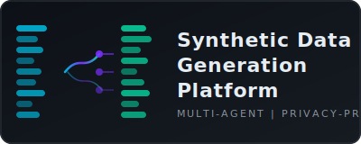

# Synthetic Data Generation Platform



A production-grade multi-agent platform that analyzes data schemas, models statistical distributions, generates privacy-preserving synthetic datasets, validates fidelity against originals, and audits privacy risk using five LangGraph agents orchestrated with FastAPI, PostgreSQL, Redis, and Streamlit.

## What it does

Upload a JSON schema or sample CSV. The platform runs five specialized agents in sequence: schema analysis, distribution modelling, data generation, fidelity validation, and privacy auditing. Download the results as JSON or CSV.

## Features

- Five LangGraph agents in a directed acyclic pipeline
- Statistical fidelity scoring using KS test and chi-square test
- Privacy risk audit: exact match detection, quasi-identifier analysis, sensitive field classification
- JWT authentication with BOLA prevention
- SlowAPI rate limiting on every endpoint
- Full security headers on every response
- Groq LLM enhancement with deterministic fallbacks when no API key is set
- Streamlit dashboard with analytics, job history, and data preview
- Docker Compose for one-command deployment

## Author

[Bandaluppi Sai Venkata Ganesh](https://github.com/SaiVenkataGaneshBandaluppi)

## Tech Stack

- FastAPI, LangGraph, Groq (Llama-3.3-70b-versatile)
- PostgreSQL 16, Redis 7, SQLAlchemy async
- Streamlit dashboard with Plotly dark-theme charts
- Docker Compose, GitHub Actions CI
- scipy for statistical distribution modelling

## Five Agents

1. schema_analyzer_agent: Infers column types, computes statistics, detects relationships
2. distribution_modeler_agent: Fits normal, exponential, categorical, datetime, boolean distributions
3. data_generator_agent: Generates N rows respecting distributions and constraints
4. quality_validator_agent: KS test and chi-square fidelity scoring per column, overall score 0 to 100
5. privacy_auditor_agent: Exact match, quasi-identifier, sensitive field, and direct identifier checks

## Prerequisites

- Python 3.11 or higher
- Docker and Docker Compose (for full deployment)
- PostgreSQL 16 (or use Docker Compose)
- Redis 7 (or use Docker Compose)

## Setup

Copy the example environment file and fill in required values:

```
cp .env.example .env
```

Start all services with Docker Compose:

```
docker compose up -d
```

Or run locally:

Install dependencies:

```
pip install -r requirements.txt
```

Run the API server on port 8010 (set via PORT env or in your process manager):

```
uvicorn app.main:app
```

Run the Streamlit dashboard on port 8505 (Streamlit reads STREAMLIT_SERVER_PORT):

```
streamlit run streamlit_app.py
```

Generate sample schema files for testing:

```
python data/generate_sample_schemas.py
```

Generate the SVG logo:

```
python assets/generate_logo.py
```

## Usage

1. Open the Streamlit dashboard at http://localhost:8505
2. Register an account or log in
3. On the Generate Data page, paste a JSON schema or upload a sample CSV
4. Select a domain and set the row count (up to 10000)
5. Click Run Generation to execute the full five-agent workflow
6. View fidelity score, privacy risk level, and data preview
7. Download results as CSV

The API is available at http://localhost:8010. All endpoints except /health, /auth/register, and /auth/login require a JWT Bearer token.

## Groq API Key

Set `GROQ_API_KEY` in your `.env` file to enable LLM-enhanced schema analysis and distribution validation via Groq (Llama-3.3-70b-versatile). Leave it blank to run entirely on deterministic statistical logic — all five agents operate without an API key.

## Tests

Install dev dependencies:

```
pip install -r requirements-dev.txt
```

Run the test suite:

```
pytest tests/ -v
```

Run with coverage:

```
coverage run -m pytest tests/ -v
coverage report
```

## License

MIT
